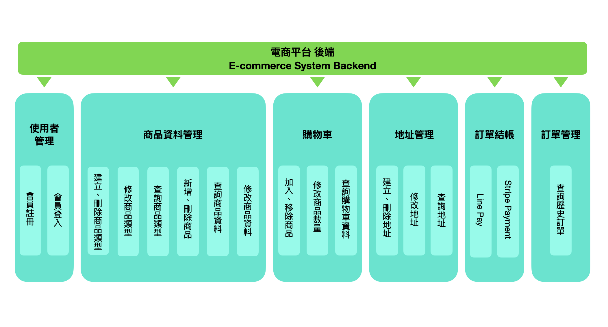
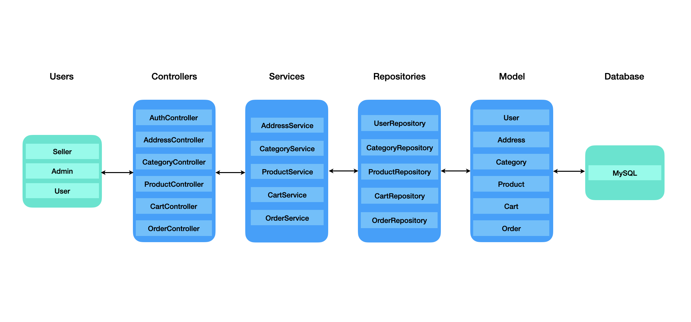
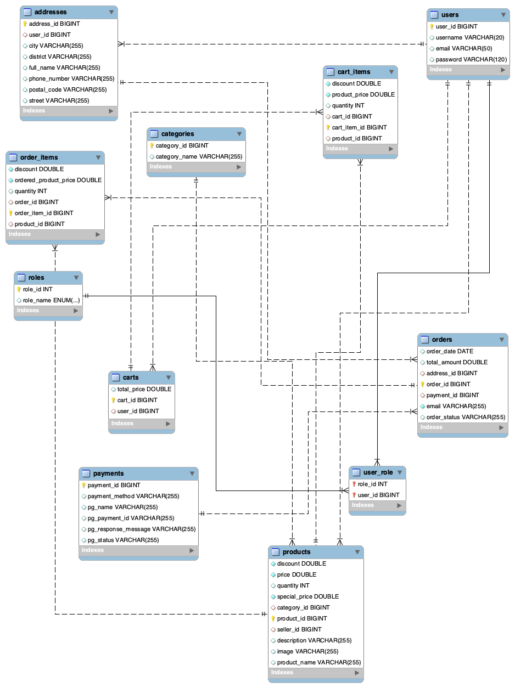

# 電商平台（Ecommerce System）

# 系統介紹
本專案為模擬 線上購物商城 的練習專案，採用 前後端分離架構：
- 前端：以 React.js + Tailwind CSS 開發，提供使用者操作介面。
- 後端：以 Spring Boot + MySQL 建立 RESTful API，並支援 JWT 驗證與授權。
- 支付串接：支援 Line Pay 與 Stripe，模擬完整線上購物付款流程。
- 本檔案為 **前端原始碼**，後端原始碼請見：[E-commerce | 前端原始碼](https://github.com/felixven/ecommerce-frontend.git)

# 功能介紹
- 使用者管理：註冊 / 登入 / JWT Token 驗證。
- 商品類型/商品 CRUD：建立、更新、刪除、查詢。
- 購物車：加入商品、調整數量、刪除商品。
- 地址 CRUD：建立、更新、刪除、查詢。
- 訂單結帳：使用LinePay或Stripe付款、送出訂單。
- 訂單管理：歷史訂單狀態。

# 系統架構
### 系統架構圖
下圖為系統功能架構圖，將前述六大模組與其細部功能以總覽方式呈現：

<br/>

### 程式分層設計
後端採用 **分層架構設計**，依職責將程式劃分Controller、Service、Repository 與 Model，各層責任如下：
 - **Controller 層**：接收 API 請求，回傳 JSON 回應（例如：`ProductController`, `OrderController`）  
 - **Service 層**：處理業務邏輯（例如：`ProductService`, `OrderService`）  
 - **Repository 層**：透過 Spring Data JPA 與 MySQL 互動（例如：`ProductRepository`, `OrderRepository`）  
 - **Model 層**：資料表對應的實體類別（例如：`User`, `Product`, `Order`）

<br/>

### 資料庫設計
本系統主要資料表及其關聯設計如下所示：

1. 使用者與權限
   - `users`：使用者
   - `roles`：角色
   - `user_role`：使用者與角色關聯
   - `addresses`：使用者收件地址   
<br/>
2. 使用者與權限
   - `products`：商品
   - `categories`：商品分類
<br/>
3. 購物與訂單
   - `carts`：購物車
   - `cart_items`：購物車商品內容
   - `orders`：訂單
   - `order_items`：訂單商品內容
<br/>
4. 付款
   - `payments`：付款紀錄



### 使用技術
- Java Spring Boot
- MySQL

## 本機安裝與使用

1. 建立資料庫
   ```bash
   CREATE DATABASE ecom_db;
   ```
2. 取得原始碼
   ```bash
   git clone https://github.com/felixven/ecommerce-backend.git
   cd ecommerce-backend
   ```
   
3. 設定資料庫與環境  
   編輯 `src/main/resources/application.properties`，填入以下內容：

   ```properties
   spring.datasource.url=jdbc:mysql://localhost:3306/ecom_db
   spring.datasource.username=<yourusername>
   spring.datasource.password=<yourpassword>
   # 請將 <yourusername> 與 <yourpassword> 替換為您本機 MySQL 的username和password。

   spring.jpa.hibernate.ddl-auto=update

   # JWT 金鑰（自行更換）
   jwt.secret=your-secret-key
   
   # 前端端點
   frontend.url=<frontend URL>
   ```
   
4. 啟動後端服務
   ```bash
   ./mvnw spring-boot:run
   #預設服務位置：http://localhost:8080
   ```
5. 預設帳號
   專案啟動後會自動建立預設帳號，可直接在Postman Sign In API Request Body 填入再進行測試，亦可透過Sign Up API 建立新帳號：
   - Admin帳號
     - 帳號：admin
     - 密碼：adminPass
     - Request Body Json 範例：
        ```json
        {
         "username":"admin",
         "password":"adminPass"
        } 
        ```
   - User帳號
     - 帳號：user1
     - 密碼：password1
     - Request Body Json 範例：
       ```json
        {
         "username":"user1",
         "password":"password1"
        }
        ```
6. 測試 API (Postman Collection)
   - 匯入本專案提供的 [Postman Collection](docs/Spring_Boot_Ecommerce_API.json)
   - 匯入本專案提供的 [Postman Environment](docs/ecommerce_env.json)
   - 開啟 Postman，選擇 `ecommerce_env` 環境，點擊 **Run Collection**  

7. 若要實測 Stripe 與 Line Pay API，請在專案啟動前設定以下環境變數：
   - STRIPE_SECRET_KEY
   - LINEPAY_CHANNEL_ID
   - LINEPAY_KEY
   - LINEPAY_URL
   ```properties
    #STRIPE KEY
    stripe.secret.key=${STRIPE_SECRET_KEY}

    #LINE PAY
    linepay.channel.id=${LINEPAY_CHANNEL_ID}
    linepay.channel.secret=${LINEPAY_KEY}
    linepay.api.url=${LINEPAY_URL}
    ```
   


